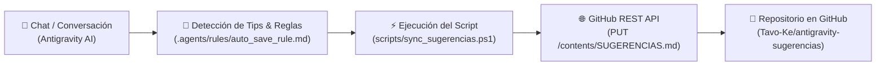

# ⚙️ Arquitectura y Programación del Guardado Automático

Este documento explica en detalle técnico cómo está programado y estructurado el sistema de **guardado y sincronización automática** de notas y tips entre **Antigravity AI** y el repositorio de GitHub [`Tavo-Ke/antigravity-sugerencias`](https://github.com/Tavo-Ke/antigravity-sugerencias).

---

## 🏗️ 1. Arquitectura del Sistema

El flujo automatizado se compone de 3 capas principales:



---

## 🛠️ 2. Componentes del Código

### A. Regla de Disparo de la IA (`.agents/rules/`)
Instruye a Antigravity a evaluar de manera continua cada mensaje en busca de configuraciones, soluciones o tips.

### B. Script de Sincronización en PowerShell (`scripts/sync_sugerencias.ps1`)
El script realiza los siguientes pasos técnicos:
1. **Autenticación en GitHub API:** Utiliza el token de acceso personal (PAT Classic) enviado en el encabezado `Authorization: token <PAT>`.
2. **Lectura y SHA Check:** Consulta la API de GitHub (`GET /repos/{owner}/{repo}/contents/{path}`) para obtener el hash `sha` de la versión actual del archivo en la nube.
3. **Codificación UTF-8 Limpia:** Convierte el texto local a una matriz de bytes en UTF-8 y luego a una cadena en `Base64` pura para evitar caracteres corruptos o problemas de tildes.
4. **Envío de Commit:** Ejecuta un `PUT` a la API de GitHub con el nuevo contenido en Base64 y el SHA correspondiente.

---

## 📜 3. Script PowerShell Completo (`scripts/sync_sugerencias.ps1`)

```powershell
$token = "ghp_..." # Token con scope 'repo'
$owner = "Tavo-Ke"
$repo  = "antigravity-sugerencias"
$path  = "SUGERENCIAS.md"

$headers = @{
    "Authorization" = "token $token"
    "User-Agent"    = "Antigravity-Agent"
    "Accept"        = "application/vnd.github.v3+json"
}

# 1. Obtener SHA del archivo en GitHub
$fileInfo = Invoke-RestMethod -Uri "https://api.github.com/repos/$owner/$repo/contents/$path" -Method Get -Headers $headers

# 2. Codificar contenido local a UTF-8 Base64
$fileBytes = [System.IO.File]::ReadAllBytes("RUTA_LOCAL_SUGERENCIAS.md")
$base64Content = [System.Convert]::ToBase64String($fileBytes)

# 3. Enviar actualización vía REST API
$body = @{
    message = "docs: auto-guardar nuevo tip/nota en SUGERENCIAS.md"
    content = $base64Content
    sha     = $fileInfo.sha
} | ConvertTo-Json

Invoke-RestMethod -Uri "https://api.github.com/repos/$owner/$repo/contents/$path" -Method Put -Headers $headers -Body $body -ContentType "application/json"
```

---

## 🔄 4. Ciclo de Ejecución Automática

1. **Identificación:** La IA detecta un tip o solución (ej. fix de `ExecutionPolicy` o configuración de PAT).
2. **Generación Local:** Genera la entrada estructurada y la añade localmente en UTF-8.
3. **Sincronización:** Ejecuta el script de sincronización con GitHub API en segundo plano.
4. **Verificación:** Confirma al usuario con el enlace `html_url` al archivo actualizado.
